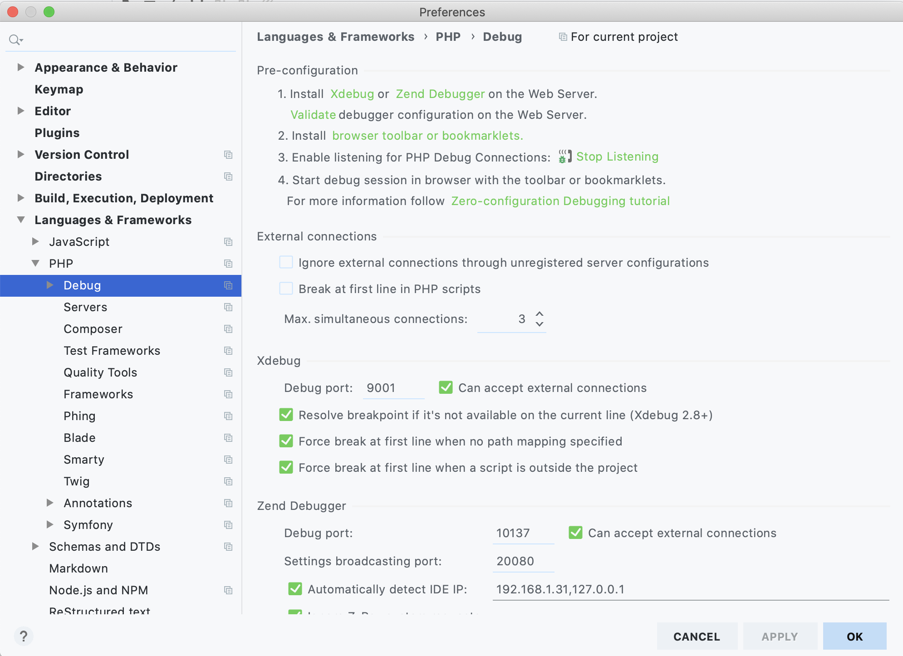

# docker-php-xdebug-nginx

Based on [Shana's Article](https://x-team.com/blog/docker-compose-php-environment-from-scratch/).

## Running container
```shell script
$ cd docker
$ docker-compose up --build
```

## Helpers
### Xdebug version
In order to check Xdebug version we need to use the interactive shell of Docker. For that, run:
```shell script
$ docker exec -it docker_php-fpm_1 /bin/sh  
```

We will be prompt into the sh of the container and therefore, we will be able to execute:
```shell script
$ php -i | grep Xdebug
with Xdebug v2.9.8, Copyright (c) 2002-2020, by Derick Rethans
Support Xdebug on Patreon, GitHub, or as a business: https://xdebug.org/support
```

### Jetbrains IDE Xdebug 
In Jetbrains IDE go to: `Languages & Frameworks` > `PHP` > `Debug` > `DBGp Proxy` and set the following settings:
* `Host`: Same as the variable `XDEBUG_REMOTE_HOST`
* `Port`: Same as the variable `XDEBUG_REMOTE_PORT`
* `IDE Key`: Same as the variable `XDEBUG_IDEKEY`


Configure Xdebug port. Go to : `Languages & Frameworks` > `PHP` > `Debug` and set the following settings:
* `Xdebug` > `Debug port`:  Same as the variable `XDEBUG_REMOTE_PORT`
* `Xdebug` > `Can accept external connections`: switch to true



Finally, configure the server. Go to : `Languages & Frameworks` > `PHP` > `Servers` and set the following settings:
* `Name`: add any name
* `Host`: localhost
* `Port`: 80. It needs to match with the exposed port of nginx
* `Debugger`: Xdebug
* `Use path mappings`: switch to true. Add the mapping between our src folder and /var/www inside the container. The container absolute path needs to match with the root folder specified in `docker-php-xdebug-nginx/docker/nginx/sites/default.conf`


# TODO
[ ] MySQL 
